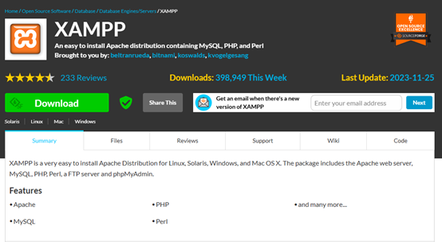
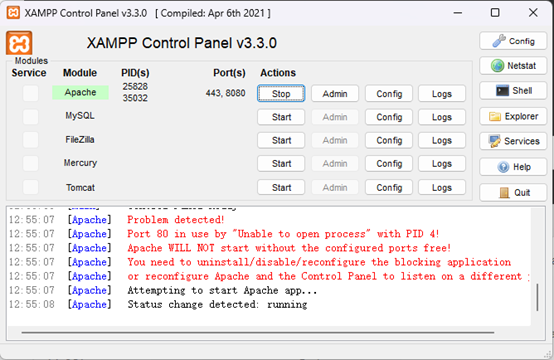
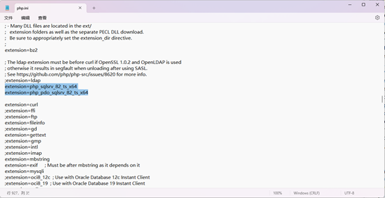
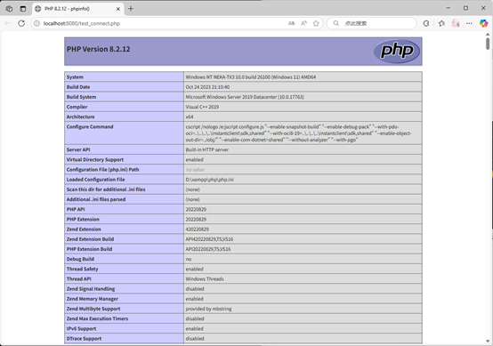
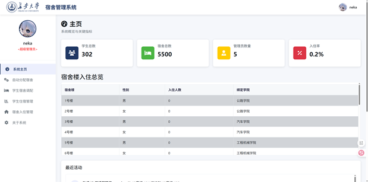
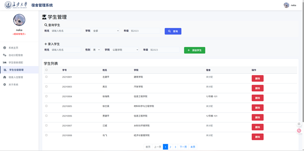
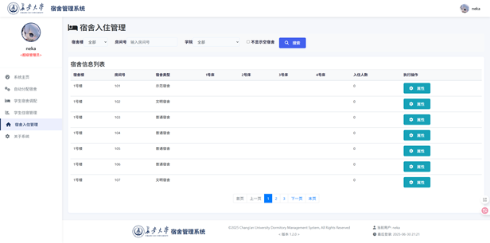

# 《长安屋舍》宿舍管理系统

本系统以 PHP + SQL Server 技术栈开发，采用 B/S 架构，借助 Apache 服务与 XAMPP 集成环境实现快速部署

---

## 目录

- [项目简介](#项目简介)
- [配置部署](#配置部署)
- [使用方法](#使用方法)
- [示例截图](#示例截图)
- [技术栈](#技术栈)
- [Author](#Author)

---

## 项目简介

在高校学生管理中，宿舍作为大学生活的第一“栖居地”，不仅影响学生的生活质量，更直接关联着校园秩序与人文氛围。《长安屋舍》宿舍管理系统正是在这一背景下应运而生。作为一款专为高校住宿打造的学生宿舍便利化管理平台，本系统以简洁明快的界面、科学合理的逻辑、简单易懂的操作，构建了从学生入住、宿舍分配、房间调换、属性配置、历史记录到基础报表统计的全流程闭环。

---

## 配置部署

### 1）XAMPP+(PHP+SQL Server)环境配置
- #### XAMPP下载安装
*XAMPP（Apache+MySQL+PHP+PERL）是一个功能强大的建站集成软件包。它可以在Windows、Linux、Solaris、Mac OS X 等多种操作系统下安装使用。*
在[XAMPP官网](https://sourceforge.net/projects/xampp/)下载安装包并安装配置。


- #### 启动Apache服务
***！！！先在xampp\apache\conf\httpd.conf中，修改开放端口与监听端口为8888或8080***
```bash
# httpd.conf中
Listen 80 -> Listen 8888
ServerName localhost:80 -> localhost:8888
```
~~使用管理员身份~~打开XAMPP控制面板（xampp-control.exe），启动Apache服务


- #### 配置php-sqlsrv驱动
***！！！PHP默认不支持SQL Server，需从[MicroSoft官网](https://learn.microsoft.com/zh-cn/sql/connect/php/download-drivers-php-sql-server?view=sql-server-ver17)下载Microsoft SQLSRV驱动***
下载完成后，选择对应php版本的pdo与sqlsrv驱动加入到xampp\php\ext文件夹下以配置环境，再修改xampp\php\php.ini应用扩展


- #### 测试PHP连接
~~激动人心的时刻！~~
在xampp\htdocs下编写测试文件test_connect.php测试PHP服务连接，通过[localhost:8888/test_connect.php](localhost:8888/test_connect.php)访问资源。
```php 
// filepath:xampp\htdocs\test_connect.php
<?php
phpinfo();
?>
```

<div style="display: flex; justify-content: center; align-items: center; height: 50px;">
  <p style = "color:blue; font-size:18px">出现如上界面，XAMPP + php 配置就完成了！</p>
</div>

### 2）项目部署

- #### GitHub Clone

```bash
# 克隆项目
git clone https://github.com/Neka-Ev/StuDorm_ManagementSystem_CHU.git
```

- #### [网盘下载 提取码：RHiE](https://pan.quark.cn/s/c38cc1d22872)

- #### qq：1320340383 获得项目！

将项目部署到本地后，找到StuDorm_ManagementSystem_CHU文件夹，将其放在xampp\htdocs目录下，服务启动后，进行数据库连接后即可使用。

---

## 使用方法

- #### 建立数据库
***使用数据库脚本文件夹下的各sql文件执行查询以建立数据库DormDB***
>CreateTable.sql =>建表
>>Data.sql =>填充数据
>>>CreatUser.sql =>创建登录用户连接数据库

- #### 连接数据库
**配置文件在StuDorm_ManagementSystem\config\db_config.php，修改配置文件可完成数据库连接**
```php
// filepath: ..\StuDorm_ManagementSystem\config\db_config.php
<?php
session_start();
$serverName = "localhost"; // 数据库服务器名称或IP地址
if (isset($_SESSION['admin']['role']) && $_SESSION['admin']['role'] === 'super_admin') {  // 检查是否为普通管理员
     $connectionOptions = array(
        "Database" => "DormDB",
        "Uid" => "dormdb_user",  
        "PWD" => "P88888888",
        "CharacterSet" => "UTF-8"
    );
} else {
   $connectionOptions = array(
        "Database" => "DormDB",
        "Uid" => "dormdb_admin",  
        "PWD" => "AAA666666",
        "CharacterSet" => "UTF-8"
    );
}
// 建立连接
$conn = sqlsrv_connect($serverName, $connectionOptions);
if ($conn === false) {
    die(print_r(sqlsrv_errors(), true));
}
?>
```
- #### 使用项目
通过[http://localhost:8080/StuDorm_ManagementSystem/index.php](http://localhost:8080/StuDorm_ManagementSystem/index.php)即可访问项目（依据Apache服务实际配置更改端口号）

---

## 示例截图
- #### 首页


- #### 仪表盘


- #### 学生管理


- #### 宿舍管理


---

## 技术栈
* 后端：PHP
* 数据库：SQL Server
* 前端：HTML + CSS + JavaScript
* 服务端：XAMPP Apache
* 开发环境：VS Code; SQL Server Management Studio
* 测试环境：SQL Server 2022; PHP 8.2.12; XAMPP v3.3.0; Windows 11 Home China 64-bit

---

## Author
> **Name**: **[Neka_Ev](https://github.com/Neka-Ev)**
> **University**: ***[Chang'an University](https://www.chd.edu.cn/)***
> **E-mail**: **wenyi4546@gmail.com**
> **GitHub**: **[StuDorm_ManagementSystem_CHU](https://github.com/Neka-Ev/StuDorm_ManagementSystem_CHU)**